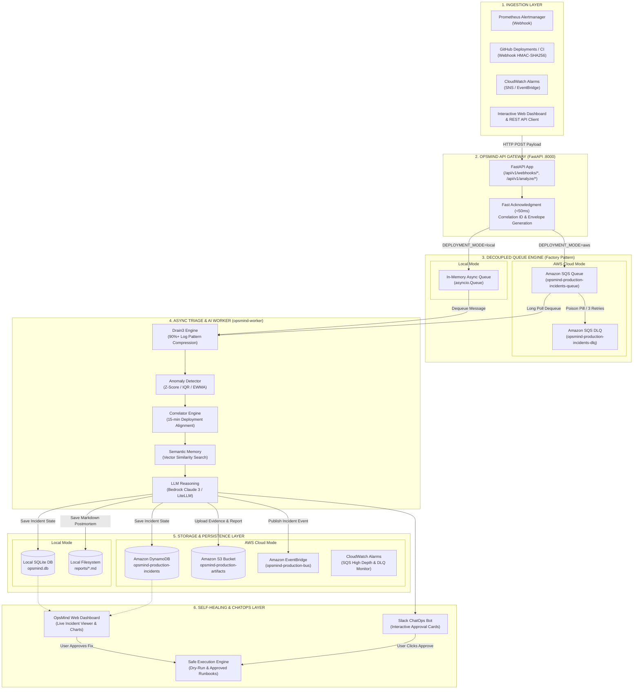
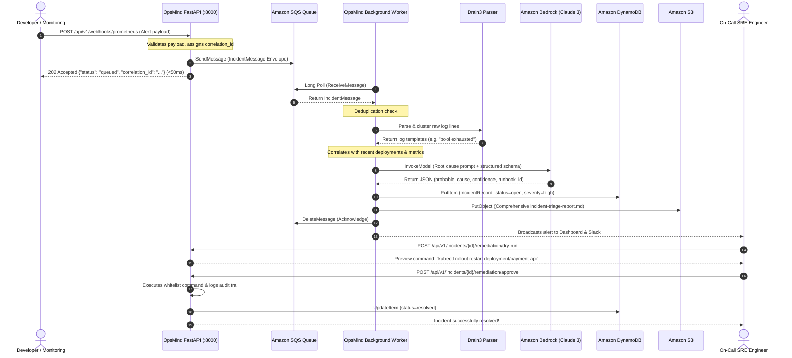

# OpsMind System Architecture & Operations Guide

> **An Autonomous AIOps & Incident Triage Engine with Self-Healing Capabilities**

---

## 1. What is OpsMind? (Simple English for Everyone)

### The Problem
Modern software runs on dozens of servers, databases, and microservices. When something goes wrong—for example, a database slows down or a website crashes at 3:00 AM—the servers produce **millions of lines of cryptic log messages** like:
```text
2026-09-12T10:00:01Z ERROR pool.go:142 [conn_timeout] database connection pool exhausted to postgres:5432 after 30000ms
```
Human engineers normally have to wake up, manually search through giant walls of text, guess what broke, and spend hours trying to fix it.

### The Solution: OpsMind
Think of **OpsMind** as a **24/7 AI Doctor and Detective for computer systems**:
1. **It listens** constantly to alerts and log messages from your servers.
2. **It filters the noise**: It collapses millions of repetitive log lines into clear patterns in milliseconds.
3. **It diagnoses**: It checks if a recent code update caused the crash, consults its AI memory of past incidents, and explains **what broke and why** in plain English.
4. **It recommends & fixes**: It generates a step-by-step fix, shows engineers a safe preview ("dry-run"), and can even fix the issue with human approval.

---

## 2. Who Uses OpsMind and What Do They Get?

| User Role | What They Do With OpsMind | What Value They Get |
| :--- | :--- | :--- |
| **Site Reliability Engineers (SREs)** | Receives automated triage cards during outages | **Reduces Mean Time to Recovery (MTTR)** from hours to under 60 seconds. |
| **Software Developers** | Submits logs or checks if a code release triggered errors | Immediately knows if their new commit caused a memory leak or crash. |
| **DevOps & Platform Teams** | Manages automated runbooks (e.g., restart pod, scale replicas) | Automates repetitive on-call tasks with safe human approval guardrails. |
| **Engineering Managers / CTOs** | Views incident postmortems and frequency trends | Ready-made executive Markdown incident reports with zero manual writing. |

---

## 3. Hybrid Architecture: Local Mode vs. AWS Cloud Mode

OpsMind is architected with a **clean abstraction layer** (Interfaces and Factory Pattern). It runs identically in two modes without changing any business logic:

1. **Local Mode (Zero Cost / Zero AWS)**:
   - Runs locally on an engineer's laptop or inside a Docker container.
   - Uses **SQLite** for state, in-memory async queues for background jobs, local disk files for artifacts, and local heuristics or OpenAI/Anthropic APIs.
   - Ideal for local development, CI testing, and cost-free evaluation.

2. **AWS Cloud Mode (Enterprise Production)**:
   - Fully decoupled, distributed serverless AWS architecture.
   - Uses **Amazon SQS & DLQ** for asynchronous queueing, **Amazon DynamoDB** for incident state, **Amazon S3** for artifact and report storage, **Amazon Bedrock (Claude 3 Haiku)** for low-cost private LLM reasoning, and **Amazon EventBridge & CloudWatch** for observability.

---

## 4. End-to-End Hybrid Architecture Diagram



---

## 5. Step-by-Step Technical Data Flow



---

## 6. AWS DevOps Infrastructure Specification

The entire AWS infrastructure is declared as code in `infra/terraform/` using Terraform v1.5+:

```text
infra/terraform/
├── main.tf          # Provider setup (AWS, Random) & resource naming conventions
├── variables.tf     # Configurable inputs (region, instance type, CIDRs, environment)
├── outputs.tf       # Exported endpoints (API URL, public IP, SQS URLs, S3 bucket)
├── ec2.tf           # Compute host, Security Group (port 8000 & 22), EBS gp3 encryption
├── iam.tf           # Least-privilege IAM Role, Instance Profile, and Bedrock policies
├── sqs.tf           # FIFO/Standard SQS Queue, Dead-Letter Queue (DLQ), and Queue Policies
├── dynamodb.tf      # Pay-Per-Request DynamoDB table with GSI on service and created_at
├── s3.tf            # AES-256 encrypted Artifacts bucket with automated 30-day lifecycle
├── eventbridge.tf   # Custom EventBridge event bus and routing rules
└── scripts/
    └── bootstrap.sh.tftpl  # Zero-error cloud-init startup template
```

### AWS Services & Security Configuration

| Service | Resource Name | Purpose & Security Configuration |
| :--- | :--- | :--- |
| **EC2 Host** | `opsmind-production-host` | Ubuntu 24.04 LTS ARM64 host running FastAPI and queue worker. Attached to `opsmind-production-sg` with port 8000 and port 22 open to authorized CIDRs. |
| **IAM Profile** | `opsmind-production-instance-profile` | **Zero static AWS keys stored on disk**. Uses IMDSv2 metadata tokens with strictly scoped least-privilege actions (`s3:GetObject`, `dynamodb:PutItem`, `sqs:ReceiveMessage`, `bedrock:InvokeModel`). |
| **SQS Queue** | `opsmind-production-incidents-queue` | Standard queue with 30s visibility timeout. Decouples fast HTTP ingestion from AI processing. |
| **SQS DLQ** | `opsmind-production-incidents-dlq` | Poison-pill isolation queue. Messages failing 3 times are moved here to prevent pipeline blockage. |
| **DynamoDB** | `opsmind-production-incidents` | On-Demand (pay-per-request) table. Stores incident IDs, status, severity, and root-cause summaries with sub-10ms latency. |
| **S3 Bucket** | `opsmind-production-artifacts-p385p6` | Encrypted with SSE-AES256. Enforces Public Access Block. Automatically purges old debug files after 30 days via S3 Lifecycle Rules. |
| **EventBridge** | `opsmind-production-bus` | Central event bus for telemetry, notifications, and cross-account incident broadcasting. |
| **Bedrock** | `anthropic.claude-3-haiku-20240307-v1:0` | Fast, cost-efficient LLM for structured JSON incident reasoning. |

---

## 7. How to Interact with OpsMind

### 1. Interactive Web Dashboard
Open in any browser:
```text
http://<EC2_PUBLIC_IP>:8000/dashboard
```
- Real-time incident feed (Open, Acknowledged, Resolved).
- System health indicators (AWS Mode, Bedrock Status, Queue Depth).
- Interactive 1-click remediation actions with dry-run previews.

### 2. Interactive OpenAPI Swagger Documentation
Open in any browser:
```text
http://<EC2_PUBLIC_IP>:8000/docs
```
- Full REST API reference.
- Test endpoints directly from the browser with interactive JSON forms.

### 3. Terminal CLI (Typer + Rich)
Run directly from your terminal:
```bash
# 1. Interactive Triage on a log file
python -m src.cli.opsmind_cli triage --service payment-api --file /path/to/server.log

# 2. List all active incidents
python -m src.cli.opsmind_cli incidents --limit 5

# 3. View an incident explanation and timeline
python -m src.cli.opsmind_cli explain <incident-id>

# 4. Start the background queue worker
python -m src.cli.opsmind_cli worker
```

### 4. Direct HTTP / curl Examples
```bash
# Health check
curl http://<EC2_PUBLIC_IP>:8000/healthz

# Readiness probe
curl http://<EC2_PUBLIC_IP>:8000/readyz

# List incidents from DynamoDB
curl http://<EC2_PUBLIC_IP>:8000/api/v1/incidents

# Ingest an alert into Amazon SQS
curl -X POST http://<EC2_PUBLIC_IP>:8000/api/v1/webhooks/prometheus \
  -H "Content-Type: application/json" \
  -d '{
    "version": "4",
    "status": "firing",
    "alerts": [{
      "status": "firing",
      "labels": {"alertname": "DatabaseDeadlock", "service": "orders-db", "severity": "critical"},
      "annotations": {"description": "Multiple transactions locked waiting for key"}
    }]
  }'
```
